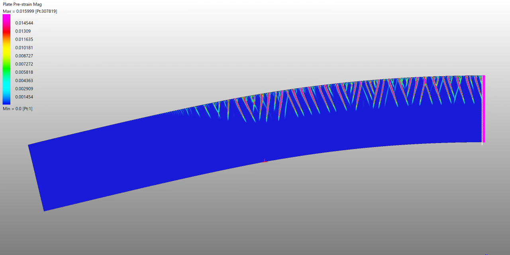

# Finite element modelling of *Plasticty Bands* phenomenon

An investigation into a distinctive plasticity phenomenon known as *transformation 
bands*. 

#### Requirements
 - Python 3.7 / 3.8, 64-bit
 - [Strand7 R3](http://www.strand7.com/r3/) (developed with Preview 40), including the API.

#### Usage
TODO

