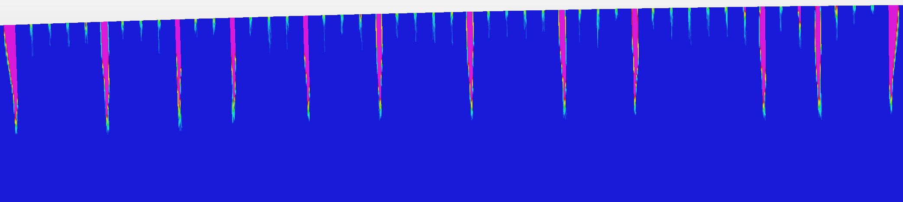

# Finite element modelling of *Plasticty Bands* phenomenon

An investigation into a distinctive plasticity phenomenon known as *transformation 
bands*. 


`adj_strain_true = 0.09`


`adj_strain_true = 0.16`


`adj_strain_true = 0.25`


`adj_strain_true = 0.36`


`adj_strain_true = 0.49`


#### Requirements
 - Python 3.7, 3.8 or 3.9, 64-bit
 - [Strand7 R3](http://www.strand7.com/r3/) R3.1.1, including the API.


#### Usage

```
> cd "D:\Tom Wilson\Documents\Code\CeramicBands"
> E:\VirtualEnvs\ceramic-bands-p38\Scripts\Activate.ps1
> python.exe .\main.py --scale_y 0.5 --random_seed 101 (for example)
```

